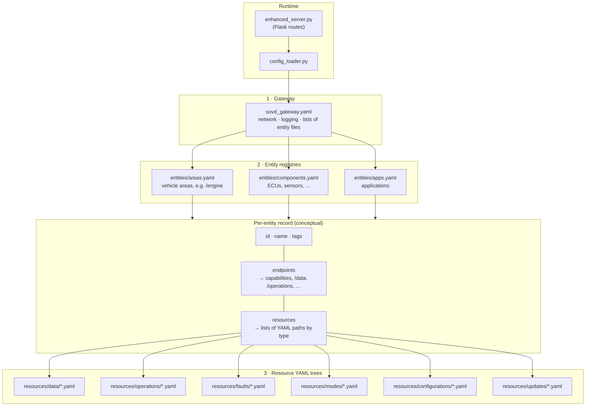

# SOVD Server

A **Service-Oriented Vehicle Data (SOVD)** server implementation based on **ISO/DIS 17978-3:2025**, with YAML-based configuration.

## Features

- **YAML-driven configuration** — Gateway, entities (areas, components, apps), and resources (data, operations, faults, modes, updates) defined in YAML under `src/sovd_server/config/`
- **RESTful SOVD API** — Collections and single-resource endpoints for data, operations, faults, and modes; software-update listings per ISO/DIS 17978-3 §7.18
- **Optional multi-response (“round-robin”) behavior** — For selected resources you can list multiple HTTP `status`/`body` pairs in YAML; the server cycles them per entity path and resource id on each `GET`/`POST` (data, operations, faults, modes)
- **No authentication** — Simplified setup for development and testing
- **CORS enabled** — Ready for web and tool clients

## Requirements

- **Python 3.9+**
- **Poetry** — [Install Poetry](https://python-poetry.org/docs/#installation) if you don’t have it

## Quick start

```bash
# Clone and enter the project
cd sovd_server

# Install dependencies (creates a virtual environment automatically)
poetry install
# or
make install

# Run the server
poetry run sovd-server
# or
make run-server
```

Server runs at **http://127.0.0.1:8080** by default. Try:

- **Health:** `curl http://localhost:8080/health`
- **Areas:** `curl http://localhost:8080/areas`
- **Engine data:** `curl http://localhost:8080/engine/data`

## Project layout

```
sovd_server/
├── src/sovd_server/           # Main package (published wheel)
│   ├── config/                # YAML configuration (runtime default)
│   ├── config_loader.py       # YAML loader
│   ├── enhanced_server.py     # Flask app (REST + capabilities)
│   ├── resource_response.py   # Round-robin response helpers
│   └── run_enhanced_server.py # CLI entry point
├── generated/                 # OpenAPI-generated models (symlinked into package for builds)
├── tests/                     # pytest (unit + Flask client tests)
├── .github/workflows/         # CI, semantic release, PyPI publish on tags
├── docs/                      # Detailed guides
├── pyproject.toml             # Project metadata (Poetry)
├── Makefile                   # Convenience commands
└── README.md
```

## Development

| Command | Description |
|--------|-------------|
| `make install` | Install dependencies (Poetry) |
| `make run-server` | Start the SOVD server |
| `make test` | Run tests |
| `make run-tests` | Run tests with coverage |
| `make lint` | Run flake8 and mypy |
| `make format` | Format code with Black |
| `make format-check` | Check formatting only |
| `make security` | Run bandit and safety |
| `make ci-local` | Lint, format-check, security, test |
| `make version` | Show package version |
| `make build` | Build wheel and sdist for distribution |
| `make clean` | Remove build artifacts and caches |

All commands run via Poetry (e.g. `poetry run pytest`). You can also run tools directly:

```bash
poetry run pytest tests/ -v
# Formatting: CI checks a subset of paths — use `make format-check` or match `.github/workflows/ci.yml`
poetry run flake8 src/ tests/
```

## Configuration

### How the YAML files connect

At runtime, **`config_loader`** reads **`sovd_gateway.yaml`** first. That file lists which **entity registry** YAML files to load (`areas`, `components`, `apps`). Each **entity** in those files (for example `/engine/ecu`) declares its REST **`endpoints`** and, under **`resources`**, a list of **per-type YAML files** (`data_resources`, `operations`, `faults`, `modes`, and so on). Those paths are resolved under `src/sovd_server/config/` and loaded when the server needs that entity or resource. **`enhanced_server`** uses the loader to satisfy each route (`GET /{entity}/data`, `.../faults`, etc.).



The gateway file also documents default **`resources.*.config_dir`** folders; the **actual binding** from an entity to a file is always the path string in that entity’s `resources` block (for example `config/resources/data/ecu_data_resources.yaml`).

For round-robin **`responses`**, software **updates**, and examples, see [docs/CONFIGURATION.md](docs/CONFIGURATION.md).

- **Gateway:** `src/sovd_server/config/sovd_gateway.yaml` — host, port, logging, entity index paths
- **Entities:** `src/sovd_server/config/entities/` — areas, components, applications
- **Resources:** `src/sovd_server/config/resources/` — data, operations, faults, modes, configurations, updates

## API overview

| Endpoint | Description |
|----------|-------------|
| `GET /health` | Health check |
| `GET /version-info` | Server version |
| `GET /areas`, `/components`, `/apps` | List entities |
| `GET /{entity}` | Entity capabilities |
| `GET /{entity}/data` | Data resource collection |
| `GET /{entity}/data/{id}` | Single data resource (optional YAML `responses` round-robin) |
| `GET /{entity}/operations` | Operations collection |
| `GET /{entity}/operations/{id}` | Operation metadata |
| `POST /{entity}/operations/{id}` | Execute operation (optional `responses` round-robin) |
| `GET /{entity}/faults` | Fault collection (optional query: `severity`, `scope`, `status`, `mask`) |
| `GET /{entity}/faults/{fault_code}` | Single fault (optional `responses` round-robin) |
| `GET /{entity}/modes` | Mode collection |
| `GET /{entity}/modes/{mode_id}` | Single mode (optional `responses` round-robin) |
| `GET /updates`, `GET /{entity}/updates` | Software update package lists (ISO §7.18) |

Example:

```bash
# Engine software part number
curl http://localhost:8080/engine/data/SoftwarePartNumber

# Start camera calibration
curl -X POST http://localhost:8080/camera/front/operations/calibratecamera \
  -H "Content-Type: application/json" \
  -d '{"calibration_type": "automatic", "target_distance": 10.0}'
```

## Installing the package

From PyPI (when published):

```bash
pip install sovd-server
sovd-server
```

From the project (editable):

```bash
poetry install
poetry run sovd-server
```

## Documentation

- [docs/INDEX.md](docs/INDEX.md) — Documentation index
- [docs/CONFIGURATION.md](docs/CONFIGURATION.md) — YAML layout, round-robin `responses`, updates
- [docs/CONTRIBUTING.md](docs/CONTRIBUTING.md) — How to contribute (including conventional commits for releases)
- [docs/DEPLOYMENT.md](docs/DEPLOYMENT.md) — Deployment, Docker, CI/CD, PyPI
- [docs/TESTING.md](docs/TESTING.md) — Running tests and matching CI locally
- [docs/VERSIONING.md](docs/VERSIONING.md) — Semantic versioning, **python-semantic-release** on `main`, tags and PyPI

## License

MIT. See [LICENSE](LICENSE) if present.
